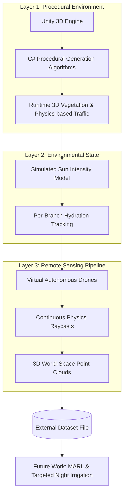

# Sandstorm Defense Ecosystem

A 3D UnityEngine project for simulating autonomous desert afforestation irrigated by drones to protect highways and infrastructure from sandstorms.

 ## Simulation Demo

**

Using spatial instancing and simulated drone raycasting, this framework serves as a scalable prototype for evaluating automated irrigation logistics and large-scale desert afforestation strategies.

## Play the Demo

You can experience the compiled simulation directly via itch.io:
**[Play the Sandstorm Defense Ecosystem on itch.io](https://oalabadi.itch.io/sandstorm-defense-system)** 

## Core Technical Features

### 1. Procedural Botany & Algorithmic Geometry
Plants in this 3D simulation are generated at runtime using C# and procedural generation. 

### 2. Environmental Simulation & Hydration
The ecosystem tracks and implements varied hydration levels across the generated vegetation, simulating realistic environmental needs. The simulation also features procedural car generation to accurately model the highway infrastructure being protected.

### 3. Simulated Drone Scanning
To mimic real-world remote sensing, the engine features a custom raycast pipeline:
* Fires continuous physics raycasts per frame.
* Detects environmental geometry, vehicles, and procedural foliage.
* Logs critically dehydrated branches to an external dataset file for future processing.

## Current Development Roadmap

- [x] Procedural branch generation
- [x] Implement varied hydration levels
- [x] Procedural car generation
- [x] Sun intensity and Dehydration rate
- [x] Hover on branch to see its hydration level
- [x] Drone Stations
- [x] Drone scanning and logging critical branches to dataset file
- [x] User settings for sun intensity and irrigation rate

## Future Development

- [ ] Program autonomous drone pathfinding to read dataset files and dispatch targeted irrigation
- [ ] Implement Multi-Agent Reinforcement Learning (MARL) for optimized fleet coordination
- [ ] Develop an alignment diagram mapping procedural tree colors directly to NDVI levels utilizing green, yellow, and red/brown indicators
- [ ] Integrate sandstorm particle physics to simulate wind velocity reduction across the procedural vegetation barrier

---
**Author:** Osama Alabbadi  
**University:** Prince Mohammad Bin Fahd University (PMU)
**Major:** Software Engineering
**Contact:** osamababadi@gmail.com | [GitHub](https://github.com/oalabadi)
